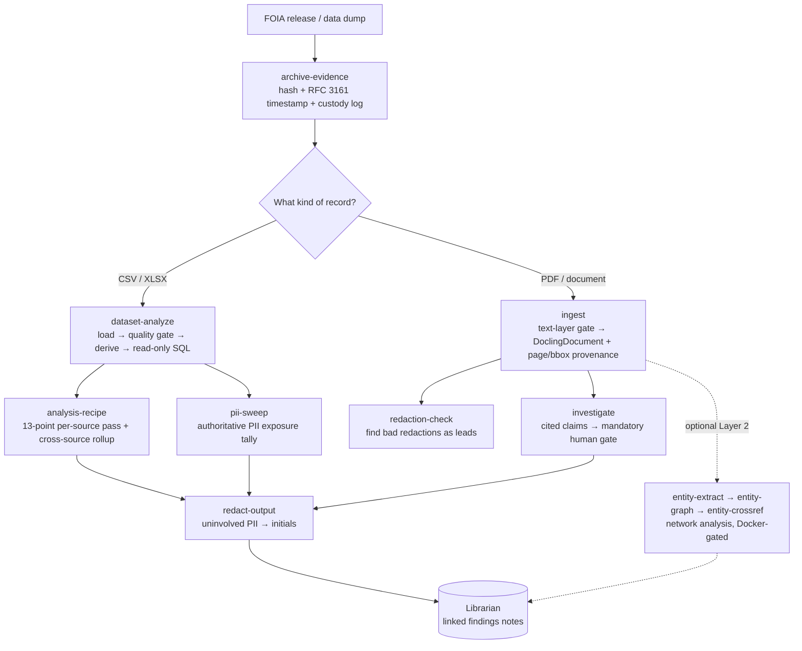

# Magpie

    

Magpie is a Claude Code plugin for the part of an investigation that happens after the records arrive. You hand it a FOIA release or a data dump (a spreadsheet, an audit log, a stack of PDFs) and it helps you turn that pile into findings you can stand behind: counted, cited back to the exact page, swept for the PII that should not be published, and filed away as linked notes. Like the bird it is named for, it gathers scattered shiny things into one nest you can actually work in.

The two ideas behind it are rigor and privacy. Every headline number goes through a check before it counts as a finding, and nothing degraded gets passed off as fact. Your records never leave your machine: the analysis runs locally in your own Claude Code session, and the tools that touch sensitive material (the PII sweep, the redaction checks) are there specifically to keep names out of anything you publish.

## How it works



## What you can do with it

- **Record where the file came from, the moment it arrives.** `archive-evidence` hashes the artifact on receipt, gets an RFC 3161 trusted timestamp proving that hash existed at a point in time, and writes an append-only, hash-chained custody log before anything touches the bytes. Ask it to "timestamp this evidence" or "record chain-of-custody on this FOIA receipt."
- **Turn a dirty spreadsheet into queryable data.** `dataset-analyze` loads a messy CSV/XLSX (encoding sniff, leading-zero IDs preserved), checks for the silent truncation that ruins a story before you analyze, derives the columns the investigation needs, and exposes the result for read-only SQL. Ask it to "analyze this FOIA dataset" or "check this export for truncation."
- **Run the same investigative checklist on every source.** `analysis-recipe` applies a fixed 13-point pass to one source (out-of-state access, immigration keywords, pretext stops, mega-users, co-travel, concentration stats, and more), then rolls findings up across sources to test whether the same actor recurs. Ask it to "run the 13-point checklist" or "roll up findings across these agencies."
- **Quantify the PII a record exposed.** `pii-sweep` runs spaCy name detection plus structured-identifier matching over a free-text field, weighted by row count, and separates officials named for accountability from third-party PII that should have been redacted. Ask it to "sweep PII exposure in this reason column."
- **Catch bad redactions before you publish, and theirs.** `redaction-check` scans a PDF for text still extractable under the black boxes, leaked metadata, unapplied redaction annotations, and embedded files, and reports each as a lead for a human. Ask it to "check this PDF for bad redactions" or "did this FOIA response leak text under the boxes."
- **Extract claims that cite back to the page.** `ingest` converts a PDF while keeping page and bounding-box provenance, and `investigate` turns it into claims anchored to an exact quote, re-checked two independent ways, and held at a mandatory human gate before anything publishes. Ask it to "extract cited findings from this document."
- **Redact the right people before publishing.** `redact-output` masks uninvolved third-party names to initials and structured PII to typed placeholders, while keeping officials and investigator-designated subjects named, and writes the full un-redacted exhibit to a local, non-vault path. Ask it to "redact this findings note before it goes in the vault."
- **Map the network (optional, Layer 2).** `entity-extract`, `entity-graph`, and `entity-crossref` pull people, organizations, and their relationships out of documents, resolve who is who across the corpus behind a human review gate, and screen them against your own corpus or opt-in watchlists. Ask it to "build an entity graph from these documents."

Every one of these files its results through **Librarian**, so findings land as linked Markdown notes in your vault instead of scattered scratch files.

## Why it’s useful

Investigations break in quiet, expensive ways: a spreadsheet that was silently cut off at a million rows, a keyword filter that flagged "police" because it contains "ice," a name left in a published note that should never have been there, a confident claim that turns out not to be in the document at all. Magpie is built to refuse each of those failures by default. It stops on a truncated export instead of analyzing a partial slice. It matches keywords on word boundaries. It treats a redaction mark as "present but withheld," never as a value. It will not let a claim publish on a span that does not support it.

The other half is the discipline you would want a careful colleague to enforce. Findings are leads until a human signs off, not verdicts. Evidence is shown before the AI's claim, so you judge the source first. Degraded citations get surfaced loudly instead of waved through. And because the heavy machine-learning pieces are optional and installed only when you need them, the everyday work (load a dataset, run the checklist, sweep for PII) stays light and runs on a laptop with nothing exotic set up.

## Quick start

Install it from the Fieldwork marketplace:

```
/plugin marketplace add TimSimpsonJr/fieldwork-plugins
/plugin install magpie@fieldwork
```

Magpie has two onramps, one per person who touches it. If you are the **operator** setting up the machine, run setup once to install the dependencies and download the models:

```
/setup
```

If you are the **investigator** using it day to day, check what is ready first (this is strictly read-only and installs nothing):

```
/doctor
```

Then point it at a record and start. For a dataset:

```
Analyze this FOIA dataset: ./exports/audit-log.csv
```

For a document:

```
Archive this PDF as evidence, then ingest it: ./releases/response.pdf
```

`doctor` tells you which workflows are ready right now and, for anything missing, the single next thing to ask your operator to install.

## Under the hood

Magpie runs in layers, and most journalists never leave the first one.

**Layer 0–1 (laptop-local, the flagship).** Pure local Python: pandas, DuckDB, and `sqlite-utils`, with the cleaned dataset served read-only through a pinned `mcp-sqlite` server so an analysis agent can query it with SQL but never write to it. The heavier pieces (spaCy for the PII sweep, Docling for PDF ingest, Free Law's `x-ray` for redaction checks) are CPU-only and sit at the edges, imported only when that specific workflow runs. No Docker, no infrastructure to manage.

**Layer 2 (entity networks, operator-tier, Docker-gated).** The optional network-analysis track: `entity-extract` (GLiNER + GLiREL), `entity-graph` (cross-document resolution into Neo4j, behind a mandatory human review gate), and `entity-crossref` (screening against your own corpus or opt-in sanctions/PEP watchlists via a local yente + OpenSearch stack). This never touches the journalist onramp, which stays Docker-free.

The capability map (run `doctor` to see your own):

| Workflow | What it needs | Tier |
|----------|---------------|------|
| Analyze datasets | pandas / DuckDB / `uvx` for the query surface | Layer 0–1 |
| PII sweep | spaCy + `en_core_web_lg` | Layer 0–1 |
| Ingest PDFs | Docling + RapidOCR (Tesseract/Ghostscript only for scan preprocessing) | Layer 0–1 |
| Redaction QA | Free Law `x-ray` / pikepdf / pdfminer | Layer 0–1 |
| Citation verify | pure stdlib (the citation engine) | Layer 0–1 |
| Evidence timestamp | `rfc3161-client` + a TSA (freeTSA by default) | Layer 0–1 |
| Extract entities | GLiNER + GLiREL (weights download on first run) | Layer 2 deps |
| Build entity graph | Docker + Neo4j | Layer 2 |
| Cross-reference entities | Docker + yente + OpenSearch | Layer 2 |

Two design rules run through everything. **Leads, not verdicts:** a check that cannot run never certifies the absence of what it checks for, and a missing required column produces a recorded "skipped," never a fake zero. **Local versus published:** raw PII, recovered under-box text, and verifier reasoning live only on local files; the published note carries aggregate counts and non-raw anchors. The full file tree and how the pieces couple together is in [MANIFEST.md](MANIFEST.md).

> [!NOTE]
> **What you need:** Python 3.12, [Claude Code](https://docs.anthropic.com/en/docs/claude-code), and a vault (Librarian installs automatically alongside Magpie). The optional machine-learning tiers (spaCy, Docling, GLiNER) are opt-in, and Claude installs them for you when you run setup. mise, Node, and Docker are contributor / full-tier only: you do not need them for everyday dataset analysis, ingest, or redaction work.

> [!IMPORTANT]
> **Your data & privacy:** Your records stay on your machine. Magpie runs locally inside your own Claude Code session; nothing is uploaded to analyze it. Two workflows exist specifically to protect people in the records: `pii-sweep` quantifies exactly what PII a release exposed and separates officials (named for accountability) from third parties who should have been redacted, and `redact-output` masks uninvolved names to initials and structured PII to typed placeholders before anything is published, while keeping the full un-redacted exhibit on a local, non-vault path. `redaction-check` also lets you verify your own PDFs before release. The served dataset is read-only and, for any PII-bearing data, built from a fail-closed allowlist so raw identifiers are never reachable by SQL.

## For developers

The dev environment is managed by [mise](https://mise.jdx.dev), which pins Python 3.12.10 and binds the project virtualenv.

```bash
mise run bootstrap   # install pinned deps into .venv
mise run test        # run the full pytest suite
```

The suite is offline by default (no API key, no network): the heavy integration tests are marker-gated (`spacy`, `docling`, `xray`, `tsa`, `gliner`, `ftm`, `neo4j`, `compose`, `yente`) and excluded from the default run, with the Track B Docker/Linux paths verified in CI. Dependencies are split across `requirements-dev.txt` (full), `requirements-offline.txt` (the trimmed CI subset), and the Layer 2 edges (`requirements-ftm.txt`, `requirements-graph.txt`, `requirements-crossref.txt`).

> **Windows / PowerShell note.** mise's shell activation relies on a prompt hook that only fires in an interactive shell, so non-interactive one-shot shells will not auto-activate. Use `mise run` / `mise exec --` there, or the always-works fallback `& .venv\Scripts\python.exe -m pytest`. Do not call bare `python`: it resolves to the global interpreter, whose versions may differ from the pinned venv.

## Part of the Fieldwork suite
- [Researcher](https://github.com/TimSimpsonJr/researcher): gather sources into cited notes
- [Magpie](https://github.com/TimSimpsonJr/magpie): analyze FOIA/data into findings
- [Librarian](https://github.com/TimSimpsonJr/librarian): file findings as linked notes (shared layer)
- [Copydesk](https://github.com/TimSimpsonJr/copydesk): write findings up in your voice

## License

MIT. See [LICENSE](LICENSE). The default tool stack is permissively licensed; copyleft / non-free tools (PyMuPDF, the GLiREL weights, the Neo4j Community image, CC-BY-NC watchlists) are clearly-labeled opt-in profiles only.
